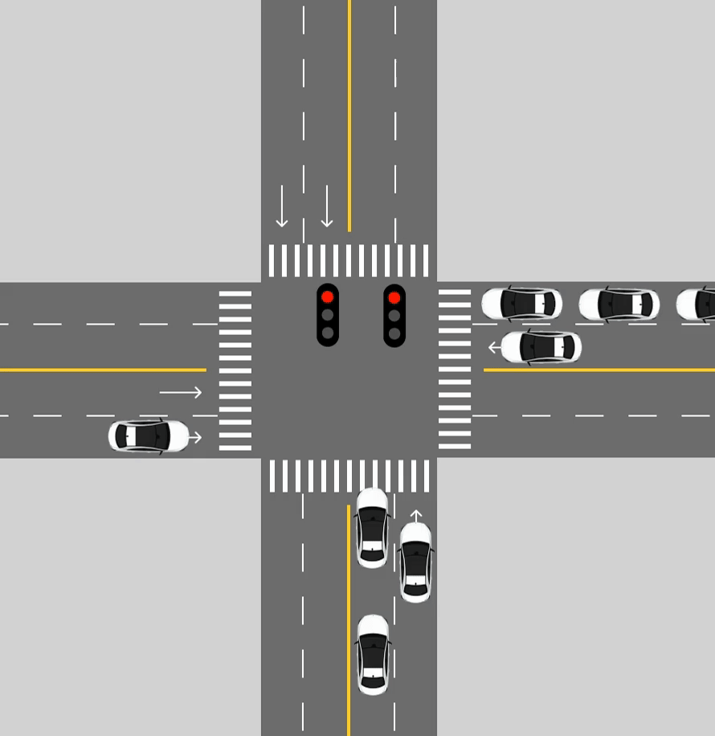
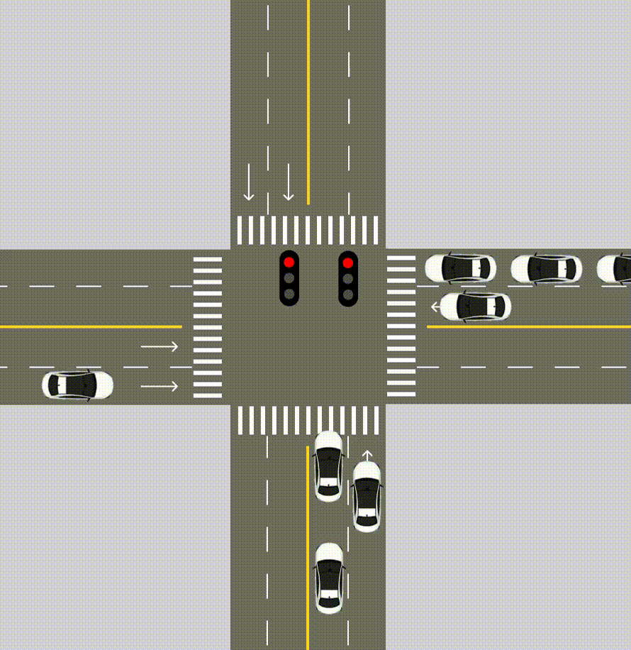
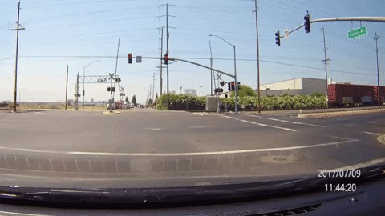

# Red-Light-Runners (RLRs)
Since moving to Roseville, CA, I have noticed a consistent theme of people running red-lights on main streets flying through intersections at more than 50 MPH. According to the *National Coalition for Safer Roads*, California has the highest fatality rate for red-light running accidents. The *Highway Loss Data Institue* also cites that in 2022, **107,000** people were injured and **1,149** people were **killed** in crashes that involved red-light running across the U.S.. 

This project aims to develop software that alerts drivers of potential red-light runners utilizing strictly dashcam footage.

## Table of Contents
- [About](#about)
- [Scoping](#scoping)
- [Data](#data)
- [Modeling](#modeling)
- [Deployment](#deployment)

## About

  
   
  <b>Animation showing normal traffic flow without an RLR event</b>

  
   
  <b>Animation showing the system detecting an RLR event and alerting the driver</b>

## Scoping
The goals of this project are develop a working prototype under relatively specific conditions.
1. The system is designed to only alert the driver of RLRs from *perpendicular* traffic.
2. The driver must be the first car in the intersection
    

## Data
Test

## Modeling

Test

## Deployment

Test
