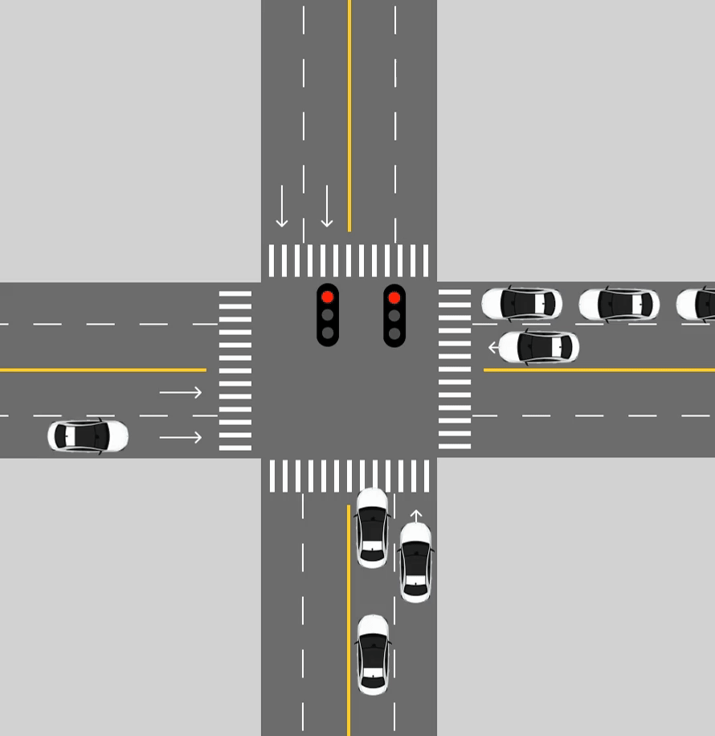

# Red-Light-Runners (RLRs)
This project aims to develop software that alerts drivers of potential red-light runners utilizing strictly dashcam footage.

## Table of Contents
- [About](#about)
- [Example Animation](#animation)
- [Scoping](#scoping)
- [Data](#data)
- [Modeling](#modeling)
- [Deployment](#deployment)

## About
Since moving to Roseville, CA, I have noticed a consistent theme of people running red-lights on main streets flying through intersections at more than 50 MPH. According to the *National Coalition for Safer Roads*, California has the highest fatality rate for red-light running accidents. The *Highway Loss Data Institue* also cites that in 2022, **107,000** people were injured and **1,149** people were **killed** in crashes that involved red-light running across the U.S.. 

## Animation

Note that in both instances, the system checks for cars in the intersection after the light turns green. 

  
   
  <b>Animation showing normal traffic flow without an RLR event</b>
   
   

  
   
  <b>Animation showing the system detecting an RLR event and alerting the driver</b>

## Scope
The goals of this project are develop a working prototype under relatively specific conditions.
1. The system is designed to only alert the driver of RLRs from *perpendicular* traffic.
2. The driver must be the first car in the intersection.
3. Data will initially be collected from the Roseville area and expanded once the system is sufficiently accurate (alerts driver ~80% of the time)

#### Potential Dashcams
| Dashcam Model        | Price   | Memory | Features                                              | Rating  | Link  |
|----------------------|---------|--------|------------------------------------------------------|---------|-------|
| **COOLCRAZY Dashcam** | $99.99  | 64G    | 4K, 1080p, 170° front camera angle, night vision(?) | 8.5/10  | [Amazon](https://www.amazon.com/COOLCRAZY-Camera-Control-Parking-Monitor/dp/B0DFM5WG8X) |
| **GMAIPOP Dashcam**  | $74.99  | 64G    | 4K, 2160p, 170° front camera angle, night vision     | 9/10    | [Amazon](https://www.amazon.com/Camera-Dashboard-Recorder-Parking-Recording/dp/B0CC9G8G9Q) |

### Project Stages
- [ ] Stop light detection (SLD) for red yellow and green
- [ ] Cross-traffic in intersection detection (CTD)
- [ ] Combine SLD and CTD
  - Assumed low success rate due to left-arrow traffic, oncoming traffic, and lane confusion
- [ ] Lane detection (LD)
  - By determining the lane the car is currently in, the system can rely on SLD and LD to follow laws of traffic
- [ ] Combine LD with SLD and CTD
- [ ] Momentum detection (MD)
  - Tagging cross-traffic cars, estimate if cars are *not* slowing down

## Data
Test

## Modeling

Test

## Deployment

Test
