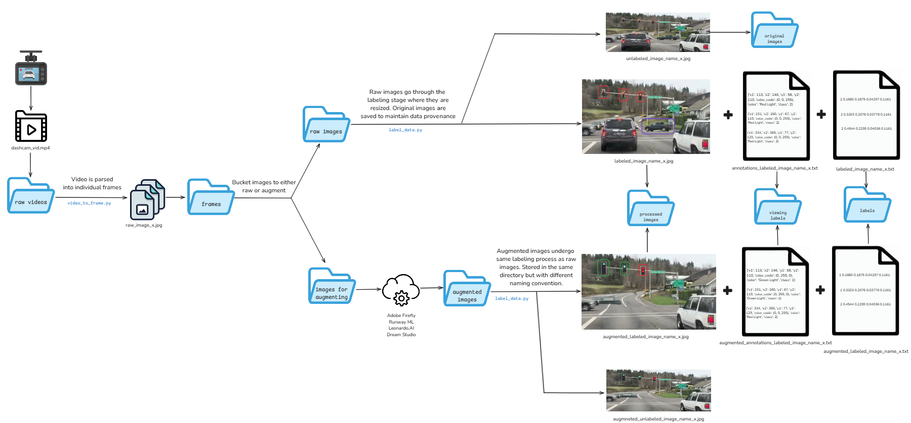

# Data
The data pipeline is orchestrated as follows:

  
   
  <b>Aspects are subject to change but the general flow is accurate</b>
   
   

## File Naming Convention
* videos/raw: YYYYMMDD_HHMMSS.mp4
* videos/trimmed: trimmed_YYYYMMDD_HHMMSS.mp4
 

* images/frames: YYYYMMDD_HHMMSS_{FRAME_NUM}.jpg
* images/processed: processed_YYYYMMDD_HHMMSS_{FRAME_NUM}.jpg
* images/for_augmenting: toAugment_YYYYMMDD_HHMMSS_{FRAME_NUM}.jpg
* images/augmented: augmented_YYYYMMDD_HHMMSS_{FRAME_NUM}.jpg